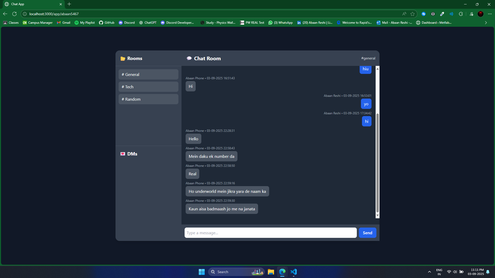
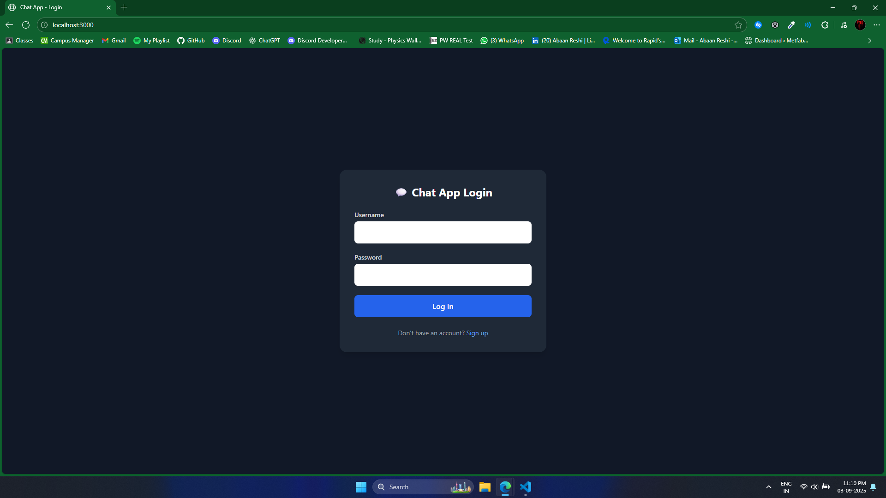
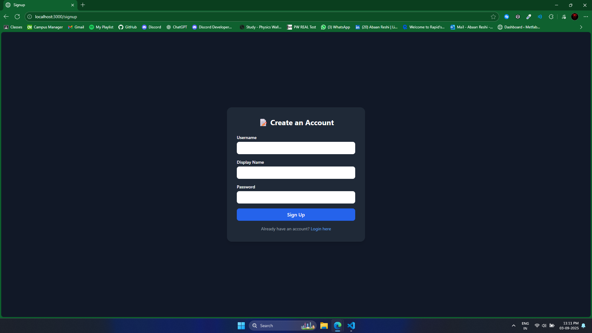

# Chat-App-2.0
---

# 💬 Real-Time Chat App

A real-time chat application with **rooms** and **direct messages**, built using **Node.js, Express, Socket.IO, and MongoDB**.  
It supports live message logging, typing indicators, and active user tracking, providing an interactive chat experience.  

---

## 🚀 Features

- **Real-time messaging** (powered by Socket.IO)
- **Chat rooms** (#general, #tech, #random, etc.)
- **Direct messages (DMs)** between users
- **Typing indicators** (“User is typing…”)
- **User presence tracking** (online users list for DMs)
- **Persistent message history** (stored in MongoDB)
- **Simple login & signup** (username, display name, password)
- **Password hashing** (using bcrypt)

---

## 🛠️ Tech Stack

- **Backend:** Node.js, Express, Socket.IO
- **Database:** MongoDB + Mongoose
- **Frontend:** HTML, Tailwind CSS, Vanilla JS  (UI layout generated with AI)
- **Other:** CORS, HTTP server, bcrypt

---

## 📂 Project Structure

````text
chat-app/
├── index.js                
├── package.json            
├── package-lock.json
├── public/                 
│   ├── index.html          
│   ├── login.html          
│   ├── signup.html         
│   ├── style.css (optional)
│   └── ...                 
├── screenshots/            
│   ├── mainpage.png
│   ├── loginpage.png
│   └── signuppage.png
└── README.md               
````

---

## ⚡ Getting Started (Run Locally)

### 1. Clone the repository

```bash
git clone https://github.com/Abaan5467/chat-app.git
cd chat-app
```

### 2. Install dependencies

```bash
npm install
```

### 3. Start MongoDB

Make sure you have MongoDB running locally (default URI: `mongodb://localhost:27017/chat-app`).

```bash
mongod
```

### 4. Run the server

```bash
node index.js
```

Server will start on:
👉 `http://localhost:3000`

### 5. Access the app

* Open `http://localhost:3000` in your browser
* Sign up, then log in
* Start chatting in rooms or DMs 🎉

---

## 📸 Screenshots

### Main Chat Interface



### Login Page



### Signup Page



---

## 🙌 Credits

* **Frontend design:** generated with the help of **AI**
* **Backend & integration:** written manually (Node.js, Express, Socket.IO, MongoDB)

---


